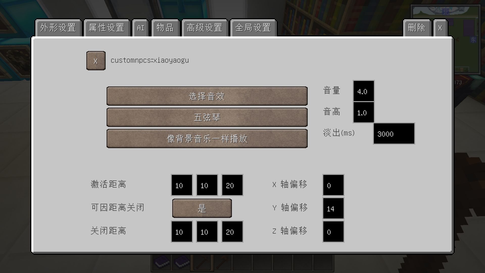

----------------

## 该分支的说明

该分支为 @[Fodoth_jinzi89](https://github.com/Fodoth-jinzi89) 为了更新《神剑创造者》而修改的版本。

注意：config中默认开启了mixin，故需要能提供mixin的依赖模组。你可以直接使用神剑里的配置（即安装unimixins）。
现在jar默认是no-mixin版本，也就是不把mixin所需要的库打包至jar中，不是说mixin就不生效了。
想要禁用mixin请在config中修改。

注意2：现在依赖 @[Mantle](https://github.com/GTNewHorizons/Mantle) 。因为添加了一个剧情书。
为了添加这本书，对Mantle原有的功能进行了大幅增强。这本书不仅字体上和SmoothFont以及@[Angelica](https://github.com/GTNewHorizons/Angelica)兼容，还实现了多页目录、章节跳转的功能。
顺带修好了原版的FontRenderer，现在换行后前一行的颜色样式如果被§r重置，不会错误地继承到下一行了。
许多模组都会改FontRenderer，请注意可能的冲突。
同样修好了NEI在物品名字后面加入的§h。现在这些非原版的样式代码不会被渲染（但仍可正常发挥逻辑作用）。

注意3：原模组1.9.3的动画功能增强我暂时不想移植，因为神剑不太用。

### 增加的功能

- 改变商人逻辑，现在兑换的物品会直接输入背包，可以按shift一键全部兑换（需要背包有空位）
- 改变存储者逻辑，支持Shift滑动存取（类似MouseTweak），并为部分其它重要GUI添加了Shift滑动支持（如商人）
- 增强吟游诗人，可以选方型范围播放，可以设置淡出
- 可配置游戏追踪NPC的范围，解决雇佣兵不传送/吟游诗人音乐突然停止的问题
- 可配置NPC是否只在被玩家（和驯服的狼）击杀时生成掉落物，解决例如凝土镇矮人炮台打败传送核心不掉东西的问题
- 修正了任务追踪器不能应用颜色代码的问题
- 修正全部汉化

### 效果图

#### 商人:

#### 吟游诗人:

#### 存储者/商人滑动支持:

